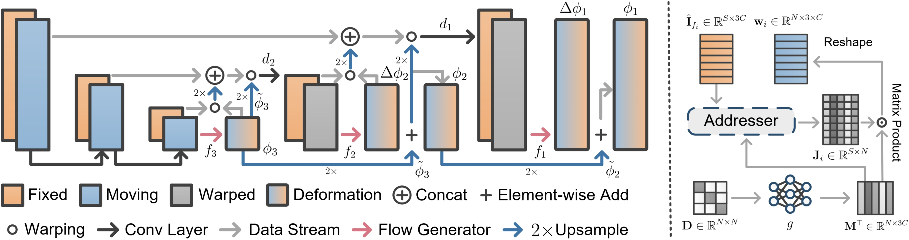
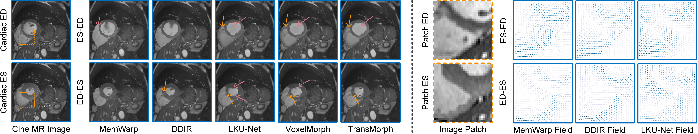

# MemWarp
[](https://pytorch.org/)
<a href="https://opensource.org/licenses/MIT"></a>
[](https://arxiv.org/abs/2407.08093)
[](https://link.springer.com/chapter/10.1007/978-3-031-72384-1_63)

This repository provides the official implementation of 
[MemWarp: Discontinuity-Preserving Cardiac Registration with Memorized Anatomical Filters](https://link.springer.com/chapter/10.1007/978-3-031-72384-1_63), MICCAI'2024 <br>
[Hang Zhang](https://tinymilky.github.io/) <a href="mailto:hz459@cornell.edu"></a>, [Xiang Chen](https://xiangchen1994.github.io/), [Renjiu Hu](https://scholar.google.com/citations?user=LH7Ru_IAAAAJ&hl=en), [Dongdong Liu](https://scholar.google.com/citations?user=pfaSYhsAAAAJ&hl=en), [Gaolei Li](https://scholar.google.com/citations?user=Y9vPI2MAAAAJ&hl=en), and [Rongguang Wang](https://scholar.google.com/citations?user=i_X02A0AAAAJ&hl=en).

## Highlights

- Achieves state-of-the-art performance in semi-supervised cardiac cine-MRI image registration, establishing a strong new baseline and **surpassing the runner-up by 7.1%** in anatomical accuracy measured by Dice.
- Introduces the first neural network solution that ensures a globally smooth deformation field while **preserving local discontinuities** under complex cardiac motion.
- Pioneers a neural network framework that **integrates image registration and segmentation** based on rooted neural network design principles, effectively fusing the two tasks with mutual benefits.

## Instructions

We provide an easy-to-use and flexible training framework that allows you to train MemWarp, MemWarp variants (e.g., with or without memory modules), and other provided baselines from scratch while seamlessly managing their checkpoints.  
The preprocessed ACDC data, as described in the manuscript, is available for research-only use via [Google Drive](https://drive.google.com/drive/folders/1gIWWtreMj-HZdghduYeZ5ydb0MzIdDfB?usp=drive_link). However, we strongly encourage readers to access the original data via [this link](https://www.creatis.insa-lyon.fr/Challenge/acdc/databases.html), ensure proper citation of their papers, and comply with all necessary rules.  

To train a full MemWarp model with all modules included, use the following command:
```
python train_cardiac_memwarp.py -m memWarpComplexDw1Sw1S32Lk5 -d acdcreg -bs 4 --dsc_w 1. --seg_w 1. --datasets_path ./../../../data/ start_channel=32 lk_size=5
```
To train a variant without memory modules and Dice loss, use:
```
python train_cardiac_memwarp.py -m lapWarpComplexS32Dw0Sw0S32Lk5 -d acdcreg -bs 4 --dsc_w 0. --seg_w 0 --datasets_path ./../../../data/  start_channel=32 lk_size=5
```
**Note:** The default `--datasets_path` is set to `./../../../data/`. You need to place the downloaded folder, i.e., `acdcreg`, under `./../../../data/`, resulting in the path `./../../../data/acdcreg`.

To train baselines, use:
```
python train_cardiacreg.py -m lkunetComplexDw1Lk5 -d acdcreg -bs 4 --dsc_w 1. --datasets_path ./../../../data/ lk_size=5 

python train_cardiacreg.py -m voxelMorphComplexDw1 -d acdcreg -bs 4 --dsc_w 1. --datasets_path ./../../../data/ lk_size=5 
```

To test MemWarp and other baselines, use the following commands:
```
python test_cardiacreg_memwarp.py -m memWarpComplexDw1Sw1S32Lk5 -d acdcreg --datasets_path ./../../../data/ start_channel=32 lk_size=5

python test_cardiacreg.py -m lapWarpComplexS32Dw0Sw0S32Lk5 -d acdcreg --datasets_path ./../../../data/ start_channel=32 lk_size=5

python test_cardiacreg.py -m lkunetComplexDw1Lk5 -d acdcreg --datasets_path ./../../../data/ lk_size=5 
```

**Important:** Ensure that the model names are identical for training and testing. The log folder will be automatically created based on the specified model name. The naming convention should follow the format `xxxxComplex*`, where `xxxx` represents the model name (e.g., `memwarp` or `lkunet`), and `*` can include any descriptive text to help identify the parameter settings.


## Network Architecture
<div align=center></div>

## Quantitative Results
| Model              | Type               | Avg. (%) | RV (%)   | LVM (%)  | LVBP (%) | HD95 (mm) ↓ | SDlogJ ↓ |
|--------------------|--------------------|----------|----------|----------|----------|-------------|----------|
| Initial            | –                  | 58.14    | 64.50    | 48.33    | 61.60    | 11.95       | –        |
| TransMorph         | Unsupervised       | 74.97    | 73.08    | 71.49    | 80.34    | 9.44        | 0.045    |
| VoxelMorph         | Unsupervised       | 75.26    | 73.10    | 71.80    | 80.88    | 9.33        | 0.044    |
| LKU-Net            | Unsupervised       | 76.53    | 74.25    | 73.23    | 82.12    | 9.13        | 0.049    |
| Slicer Network     | Unsupervised       | 79.52    | 77.83    | 76.80    | 83.93    | 8.21        | 0.044    |
| **LapWarp (ours)** | Unsupervised       | 77.25    | 75.86    | 73.92    | 81.99    | 9.23        | 0.074    |
| TransMorph         | Semi-supervised    | 81.08    | 81.73    | 75.27    | 86.23    | 7.51        | 0.091    |
| VoxelMorph         | Semi-supervised    | 81.34    | 82.03    | 75.35    | 86.64    | 6.87        | 0.082    |
| LKU-Net            | Semi-supervised    | 83.08    | 84.59    | 77.24    | 87.39    | 6.43        | 0.099    |
| Slicer Network     | Semi-supervised    | 83.68    | 84.94    | 77.97    | 88.12    | 6.10        | 0.099    |
| **MemWarp (ours)** | Semi-supervised    | **89.61**| 89.30    | **86.49**| **93.04**| **3.93**    | 0.149    |
| DDIR               | Weakly-supervised  | 88.03    | **90.02**| 85.47    | 87.61    | 9.91        | 0.121    |

## Qualitative Results
<div align=center></div>


## Citation

Please refer to [TextSCF](https://github.com/tinymilky/TextSCF) for a weakly supervised image registration method that leverages large visual language models to enhance inter-regional anatomical understanding for deformable image registration.

If [MemWarp](https://github.com/tinymilky/Mem-Warp) inspires your work or if you use our [code](https://link.springer.com/chapter/10.1007/978-3-031-72384-1_63), please cite:
```
@inproceedings{zhang2024memwarp,
  title={MemWarp: Discontinuity-Preserving Cardiac Registration with Memorized Anatomical Filters},
  author={Zhang, Hang and Chen, Xiang and Hu, Renjiu and Liu, Dongdong and Li, Gaolei and Wang, Rongguang},
  booktitle={International Conference on Medical Image Computing and Computer-Assisted Intervention},
  pages={671--681},
  year={2024},
  organization={Springer}
}
```

#### Keywords
Keywords: Deformable image registration, Cine-MRI , Convolutional neural networks, Spatially covariant filters, Memory Networks, Laplacian image pyramid.